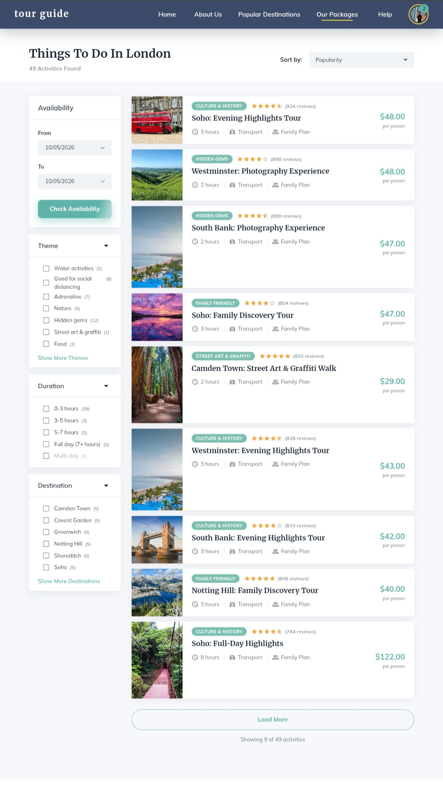
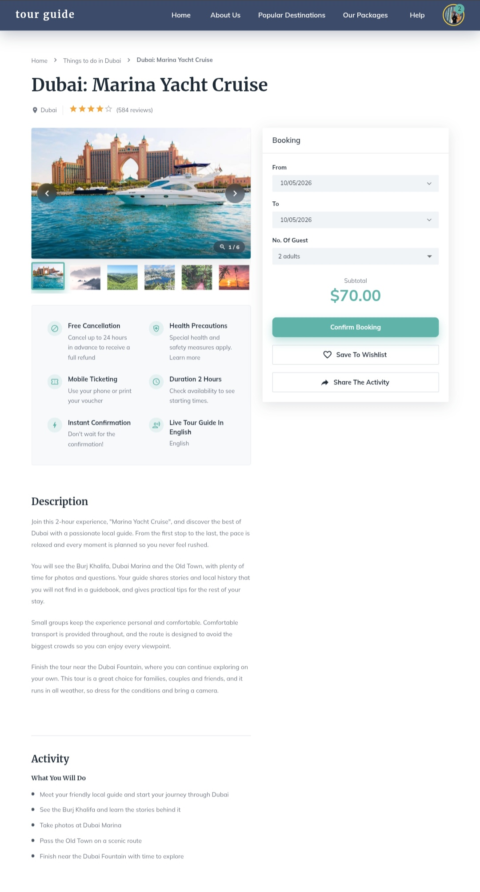
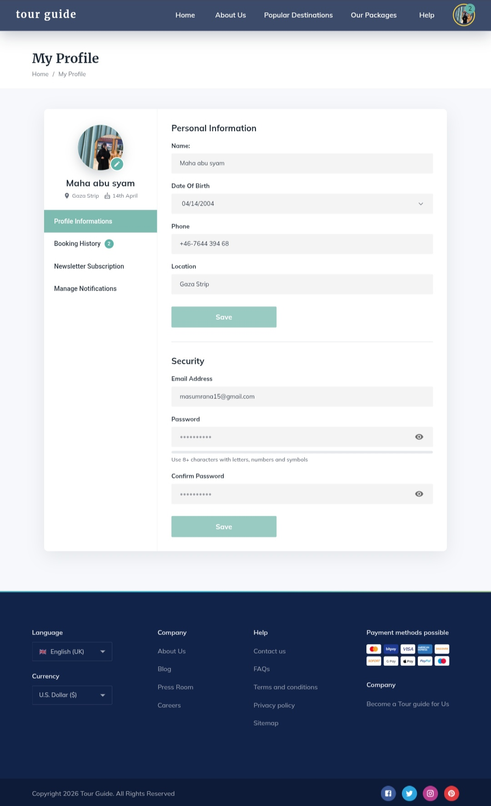
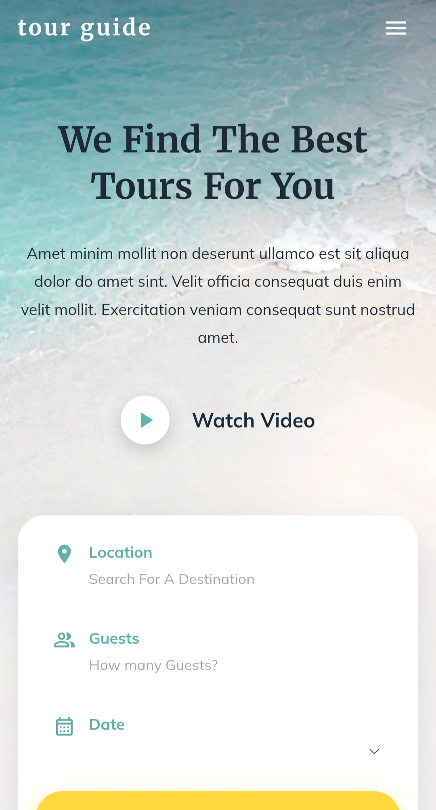

🧭 Tour Guide

A modern, fully responsive and animated tourism website built with React (JSX), Material UI, Redux Toolkit and Axios. Visitors can explore popular cities, filter and browse activities, read full trip details with reviews, book a trip, and manage their profile and booking history.

"React" (https://img.shields.io/badge/React-JSX-61DAFB?logo=react&logoColor=white)
"Material UI" (https://img.shields.io/badge/Material%20UI-0081CB?logo=mui&logoColor=white)
"Redux Toolkit" (https://img.shields.io/badge/Redux%20Toolkit-764ABC?logo=redux&logoColor=white)
"Axios" (https://img.shields.io/badge/Axios-5A29E4?logo=axios&logoColor=white)
"React Router" (https://img.shields.io/badge/React%20Router-CA4245?logo=reactrouter&logoColor=white)
"Vite" (https://img.shields.io/badge/Vite-646CFF?logo=vite&logoColor=white)
"GitHub Pages" (https://img.shields.io/badge/Deployed%20on-GitHub%20Pages-222?logo=github&logoColor=white)

«Live demo: https://mahaabusyam.github.io/tour-guide/
The UI was implemented from supplied design mockups, with a strong focus on animation, responsiveness and clean, modular code.»

## 📸 Screenshots

| Home | Things To Do |
|---|---|
| 

 | 

 |
| **Trip details** | **My Profile** |
| 

 | 

 |

### Mobile

  

---

📑 Table of contents

1. "Highlights" (#-highlights)
2. "Tech stack & engineering rules" (#-tech-stack--engineering-rules)
3. "Pages & features" (#-pages--features)
4. "Architecture" (#-architecture)
5. "Animation system" (#-animation-system)
6. "Performance" (#-performance)
7. "Reliability & error handling" (#-reliability--error-handling)
8. "Responsive design & accessibility" (#-responsive-design--accessibility)
9. "Getting started" (#-getting-started)
10. "Deployment (GitHub Pages)" (#-deployment-github-pages)
11. "Mock API & data" (#-mock-api--data)
12. "Known limitations" (#-known-limitations)
13. "Roadmap" (#-roadmap)
14. "Credits & license" (#-credits--license)

---

✨ Highlights

- 4 connected pages + a designed 404: Home, Things To Do, Trip Details, My Profile.
- Professional animation layer: scroll reveals, staggered entrances, parallax, animated counters, morphing shapes, a sliding tab indicator, hover micro-interactions, and full "prefers-reduced-motion" support.
- Redux Toolkit + "createAsyncThunk" for all global state and data fetching, with Axios as the only HTTP client.
- Smart "localStorage" layer: TTL-based response caching, persisted user data (favorites, bookings, profile, preferences) and defensive reads that survive corrupted storage.
- Shareable filters: activity filters live in the URL ("?theme=water&duration=0-3"), so the back button and shared links just work.
- Code splitting ("React.lazy") with idle-time prefetching and vendor chunking.
- Resilient by design: API response validation, an app-wide error boundary, and a dev-only diagnostics panel.
- Automated deployment with GitHub Actions to GitHub Pages.

---

🛠 Tech stack & engineering rules

Area| Choice
Language / framework| React JS (".jsx" files, no TypeScript)
UI| Material UI (MUI) for all layout, components and styling
Icons| "@mui/icons-material"
Global state & async logic| Redux Toolkit ("createSlice", "createAsyncThunk")
HTTP| Axios only (shared instance with interceptors)
Persistence & caching| "localStorage" (cache with TTL + persisted state)
Routing| React Router
Build tool| Vite
Fonts| Merriweather (headings), Mulish (body) via Google Fonts
CI/CD| GitHub Actions → GitHub Pages

Project conventions

- Every "useEffect" that subscribes to something (scroll, resize, observers, timers, keyboard, in-flight requests) cleans up after itself.
- Data fetching always goes through a thunk that supports request cancellation ("AbortSignal"), so unmounting a page cancels its pending requests.
- Logic lives outside components when possible ("utils/", "hooks/", slices) to keep components small and readable.
- Constants (labels, options, links) are kept in "constants/" instead of being hard-coded in JSX.

---

📄 Pages & features

Route| Page
"/"| Home
"/things-to-do/:cityId"| Activities listing for a city (filters via query string: "theme", "duration", "destination", "sort")
"/tours/:id"| Trip details
"/profile" ("?tab=profile | bookings | newsletter | notifications")| My Profile
"*"| Designed 404 page

🏠 Home

- Navbar: glass effect on scroll, hides when scrolling down and returns when scrolling up, scroll-progress bar, scroll-spy highlighting of the active section, animated underline, mobile drawer, and a user menu once signed in.
- Hero: Ken Burns background with scroll parallax, word-by-word title reveal, rippling "Watch Video" button, and a search bar that opens the matching city's activities and carries the chosen date and guests over to the booking card.
- Explore Popular Cities: city tabs with a pop animation, a city banner whose image, info card and category chips re-animate on every change, tour cards, a remembered last-selected city, and a link to the city's full activity list.
- Featured: a trending banner with a morphing blob image, a favorite button (persisted) and share (Web Share API with clipboard fallback), plus a scroll-snap carousel.
- Mobile app promo: two phone mockups built entirely with MUI (an auto-scrolling hotel list, an animated route on a map), mouse parallax and shine-sweep buttons.
- Gallery with a full lightbox (keyboard arrows, swipe, counter) and Latest Stories.
- Footer: language and currency selectors (persisted), link columns, payment badges, social icons, and a back-to-top button.

🗺 Things To Do (activities)

- Header with an animated results counter and sort selector.
- Filters: availability dates, Theme, Duration and Destination (with live counts per option and "Show more").
- Filters are stored in the URL, shown as removable chips, and re-trigger a staggered list animation.
- Load more pagination, empty state, and a bottom-sheet filter drawer on mobile.
- Outside The City Specials: three category carousels; each category pill links back to the list pre-filtered.
- Gallery and city stories sections.

🎫 Trip details

- Breadcrumb, animated title and rating.
- Image gallery: cross-fading slides, arrows, thumbnails that auto-center, and the shared lightbox.
- Sticky booking card: dates, guests (clamped to the trip's capacity), animated subtotal, "Confirm Booking" (recorded in booking history), wishlist toggle and share.
- Highlights, description, activity list, included / not included, safety, details, and meeting point with an embedded Google Map (tap-to-activate so it never hijacks scrolling on mobile).
- Related tours: computed from existing data (same city without the current trip, plus similar trips elsewhere), shown in carousels.
- Customer reviews: animated rating summary and category bars, sorting, traveler-type and rating filters, debounced search, "Read more", persisted "Helpful?" votes, and incremental loading.

👤 My Profile

- Demo sign-in with a navbar avatar menu (My Profile, Booking History, Sign out).
- Sidebar with an editable avatar (cropped and downsized client-side before saving) and a sliding active-tab indicator; the active tab is kept in the URL.
- Personal information and security forms with validation, error shake animation, simulated save states and a password-strength meter.
- Booking history: bookings created from the details page, with a cancel flow and links back to each trip.
- Newsletter and notification preferences, saved instantly.

🚧 404

An animated compass, the attempted path, navigation shortcuts and quick links to every destination.

🏗 Architecture

Folder structure

.
├── .github/workflows/deploy.yml     # Build + deploy to GitHub Pages
├── public/
│   ├── data/                        # Mock API (JSON files)
│   └── images/
├── src/
│   ├── api/                         # axiosInstance, validators, one file per resource
│   ├── app/store.js                 # Redux store + localStorage persistence
│   ├── assets/images/               # Bundled images (e.g. hero background)
│   ├── components/
│   │   ├── activities/              # Filters, cards, list, specials
│   │   ├── common/                  # Reveal, carousels, error boundary, loaders...
│   │   ├── home/                    # Hero, PopularCities, Featured, AppPromo, Gallery, Stories
│   │   ├── layout/                  # Navbar (+ UserMenu) and Footer
│   │   ├── profile/                 # Forms, sidebar, panels
│   │   └── tourDetails/             # Gallery, booking, sections, reviews/
│   ├── constants/                   # Nav links, options, labels, config
│   ├── features/                    # Redux slices (one folder per domain)
│   ├── hooks/                       # Reusable hooks
│   ├── pages/                       # Route-level pages
│   ├── styles/animations.js         # Shared keyframes and helpers
│   ├── theme/theme.js               # MUI theme
│   ├── utils/                       # Pure helpers (storage, formatting, filtering...)
│   ├── App.jsx                      # Routes, lazy loading, prefetching
│   └── main.jsx                     # Providers, error boundary, diagnostics
├── index.html
├── vite.config.js
└── package.json

Data flow

flowchart LR
  A[Component] -->|dispatch thunk| B[Redux Toolkit slice]
  B --> C{Fresh cache in localStorage?}
  C -- yes --> D[Return cached data]
  C -- no --> E[Axios request + validation]
  E --> F[Save to cache]
  F --> D
  D --> G[Store state]
  G -->|useSelector| A

State management (Redux Toolkit)

Slice| Responsibility| Persisted in "localStorage"
"cities"| Cities and their tours (adds unique slugs)| cache + selected city
"featured"| Trending banner and featured destinations| cache
"content"| Gallery and stories| cache
"activities"| Activities for all cities| cache
"tourDetails"| Selected trip (with catalog fallback)| cache
"reviews"| Review summary, list and "Helpful" votes| cache + votes
"booking"| Booking draft: dates and guests (shared across pages)| yes
"bookingHistory"| Confirmed and cancelled bookings| yes
"favorites"| Wishlist| yes
"preferences"| Language and currency| yes
"user"| Demo profile and notification settings| yes

A single "persist(selector, key)" helper in "store.js" subscribes to the store and saves any slice whenever it changes.

API layer

- One shared Axios instance ("api/axiosInstance.js"): base path aware, timeout, friendly error messages (including the failing URL), request-cancel awareness, and automatic image-path prefixing for sub-folder deployments.
- Validation ("api/validate.js"): each API function checks the response shape before it can enter the store or the cache. A missing JSON file therefore produces a clear error with a Retry button, not a blank screen.
- Cache ("utils/storage.js"): "loadCache" / "saveCache" with TTL (10 minutes), type checks and automatic removal of corrupted entries. Cache keys are versioned (e.g. "cities_cache_v3") so format changes can invalidate old data.

Trip catalog

Trips can come from several sources (city tours, featured items, activities). A catalog builder merges them into one slug-indexed lookup. A detailed trip in "tours.json" wins; otherwise the trip's card data is merged into a template, so every link in the site opens a working details page.

---

🎬 Animation system

All animation helpers are shared and reusable:

Piece| Purpose
"Reveal" + "useInView"| Fade/slide elements in when they enter the viewport (configurable direction, delay, duration)
"styles/animations.js"| Central keyframes (morph, float, ripple, shine, shake, swing, ...) plus "withMotion()" and "enter()" helpers
"useAnimatedNumber"| Smooth count-up for prices, ratings and counters
"useMouseParallax" / "useScrollParallax"| Parallax driven by CSS variables, with no re-renders while moving
"useActiveSection"| Scroll-spy via "IntersectionObserver"

Principles

- Animate "transform" and "opacity" wherever possible (GPU-friendly).
- Respect "prefers-reduced-motion": animations are disabled through "withMotion()" and media queries.
- Re-key components ("key={...}") to replay entrance animations when data changes.
- Keep reveal wrappers and hover effects on separate elements so their "transform"s never conflict.

---

⚡ Performance

- Route-level code splitting with "React.lazy" and "Suspense" (the Home page stays in the main bundle). A delayed loader avoids flashes for fast loads.
- Idle prefetching of the other pages after the first paint (skipped when the user enables Data Saver).
- Vendor chunking ("mui", "mui-icons", "router", "state") for better long-term caching.
- Lazy-loaded images with async decoding, fixed aspect ratios to avoid layout shift, and an image-compression workflow (WebP, size targets per image type).
- Memoized derived data ("useMemo") for filtering, sorting and related-trip computation.
- Debounced search input.

🛡 Reliability & error handling

- Error Boundary: any rendering error shows a friendly recovery page (with the stack trace in development).
- Dev-only diagnostics panel: surfaces runtime errors, unhandled promise rejections, React warnings and missing images on screen, which is especially useful when developing on a phone. It is excluded from production builds.
- Hardened storage reads: values are type-checked against their defaults, so corrupted "localStorage" can never crash the app.
- Sanitized inputs: unknown query-string values (sort, tab) fall back to safe defaults; guest counts are clamped to each trip's capacity.
- Security note: passwords are only validated in the form and are never stored in state or "localStorage".

---

📱 Responsive design & accessibility

- Mobile-first layouts with CSS Grid using "minmax(0, 1fr)" columns to prevent horizontal overflow, plus a global "overflow-x: clip" safety net that keeps "position: sticky" working.
- Touch-friendly interactions: swipeable lightbox, scroll-snap carousels, bottom-sheet filters, and always-visible carousel arrows on touch devices.
- Semantic HTML and ARIA: labelled controls, "aria-current", "aria-pressed", "aria-expanded", progress bars with values, and "role="alert"" for form errors.
- Full keyboard support for galleries, the lightbox, filters and menus, with visible focus styles.
- "prefers-reduced-motion" respected across the site.

---

🚀 Getting started

Prerequisites

- Node.js 18+ (the CI uses Node 22)
- npm

Install and run

git clone https://github.com/mahaabusyam/tour-guide.git
cd tour-guide
npm install
npm run dev

Because the app is configured with "base: '/tour-guide/'" (see below), open the URL that Vite prints, including the "/tour-guide/" path, for example "http://localhost:5173/tour-guide/".

Scripts

Command| Description
"npm run dev"| Start the development server
"npm run build"| Create a production build in "dist/"
"npm run preview"| Serve the production build locally (verify before deploying)

Configuration

Setting| Where| Notes
Base path| "vite.config.js" → "base"| Use "'/tour-guide/'" for a project site ("user.github.io/tour-guide/"), or "'/'" for a root site or other hosts. Everything else (router, data requests, image paths) follows "import.meta.env.BASE_URL" automatically.
API base URL| "VITE_API_URL" (optional ".env")| Leave unset to use the bundled JSON files in "public/data".

---

🌐 Deployment (GitHub Pages)

Deployment is automated with GitHub Actions: every "git push" to the main branch builds the app and publishes it.

1. In the repository go to Settings → Pages → Build and deployment → Source and choose GitHub Actions.
2. The workflow in ".github/workflows/deploy.yml" installs dependencies, runs "npm run build", copies "index.html" to "404.html", and publishes "dist/".
3. Push your changes:

git add .
git commit -m "Describe your changes"
git push

4. Follow progress in the Actions tab; the site is live once the run turns green.

Why "404.html"? GitHub Pages is a static host, so opening a deep link such as "/profile" directly would otherwise return a server-side 404. Serving the app shell as "404.html" lets the client-side router handle the URL.

«Tip: if the site looks outdated after a deploy, make sure the run succeeded in the Actions tab, then reload in a private tab. Browsers and GitHub cache pages for a few minutes.»

---

🗃 Mock API & data

There is no backend. Data is served as static JSON from "public/data/" and fetched through Axios exactly as a real API would be, so swapping in a real backend later only means changing the URLs in "src/api/".

File| Content
"cities.json"| Cities and their tours
"featured.json"| Trending banner and featured destinations
"gallery.json" / "stories.json"| Gallery images and blog stories
"activities.json"| Activities for all cities (themes, duration, price, rating)
"tours.json"| Fully detailed trips (description, activities, safety, meeting point...)
"reviews.json"| Review summary and review list

Images live in "public/images/". Paths in JSON files start with "/images/..." and are prefixed with the deployment base path at runtime.

---

⚠️ Known limitations

This is a front-end showcase, so a few behaviors are intentionally simulated:

- Authentication is a demo: "Sign In" signs in a sample user; there are no real accounts.
- Bookings are local: bookings are stored in the browser only; no payment or availability is processed.
- Availability check saves the chosen dates; real availability would need a backend.
- Language selector stores the preference, but the interface is English only for now.
- Currency selector stores the preference; prices are not converted.
- Review lists and some trip details are shared templates rather than per-trip content.

---

🗺 Roadmap

- [ ] Real backend (REST or GraphQL) with authentication
- [ ] Per-trip reviews and availability
- [ ] Internationalization with full RTL support (Arabic)
- [ ] Unit and integration tests (Vitest, React Testing Library) and E2E tests (Playwright)
- [ ] Automated accessibility audit (axe) and Lighthouse checks in CI
- [ ] Responsive images ("srcset") via an image CDN
- [ ] Installable PWA with offline support
- [ ] Real payment flow

---

🙏 Credits & license

- UI design: supplied mockups, implemented with Material UI.
- Icons: "Material Icons" (https://mui.com/material-ui/material-icons/). Fonts: "Merriweather" (https://fonts.google.com/specimen/Merriweather) and "Mulish" (https://fonts.google.com/specimen/Mulish).
- Photos: replace placeholder images with ones you have the rights to use.

Author: "< eng.maha abu syam>" · "GitHub" (https://github.com/mahaabusyam)

License: [MIT](LICENSE).